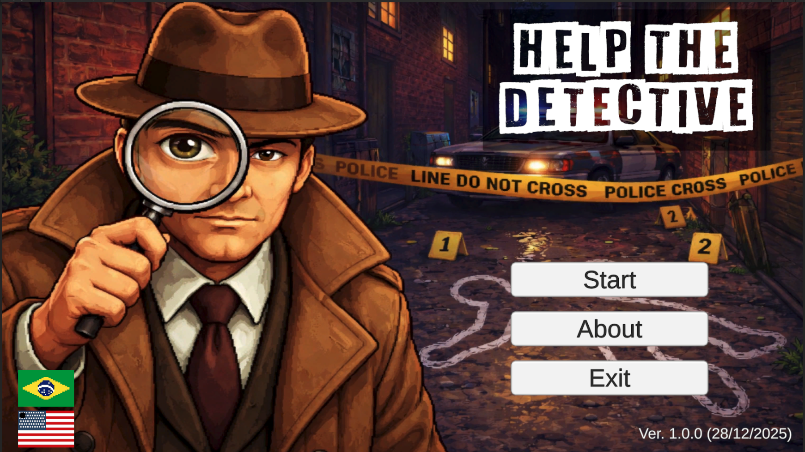
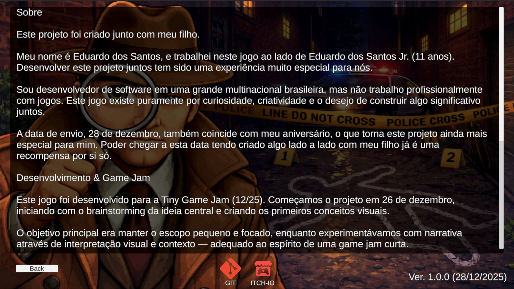
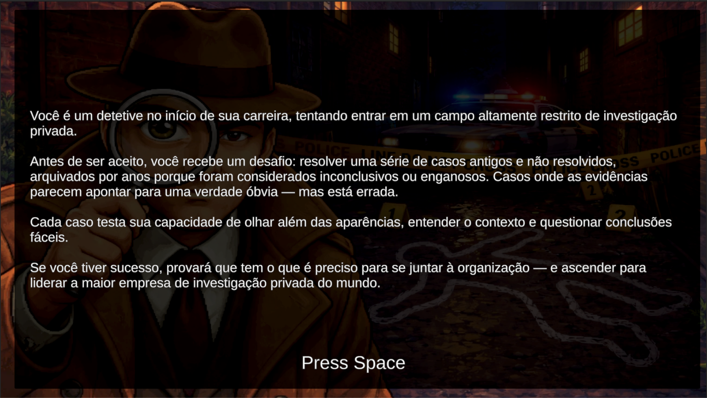
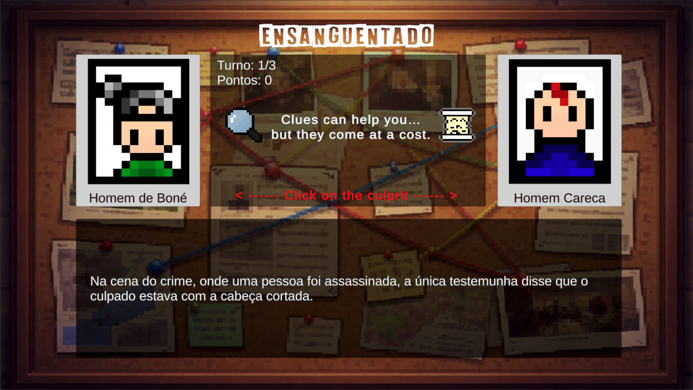
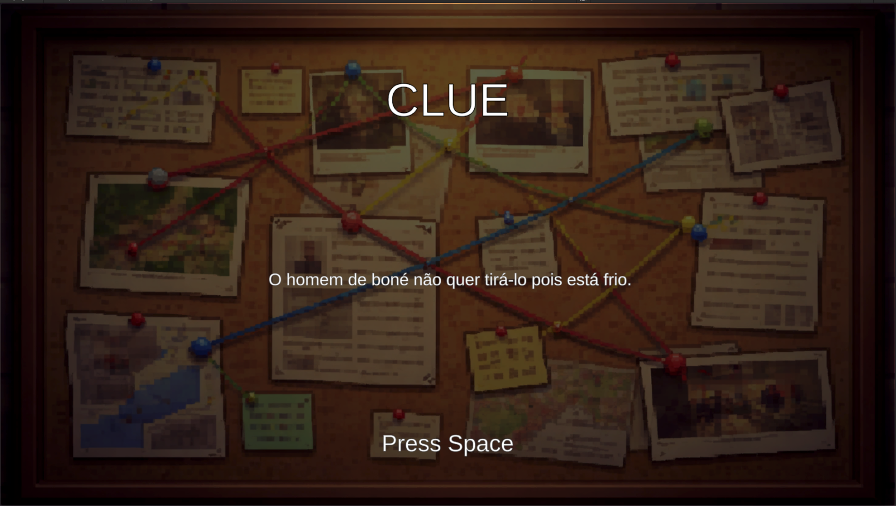
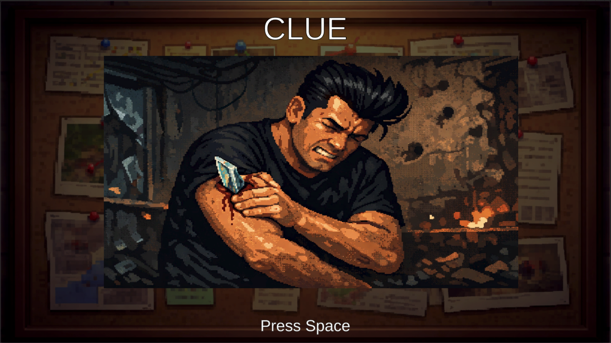
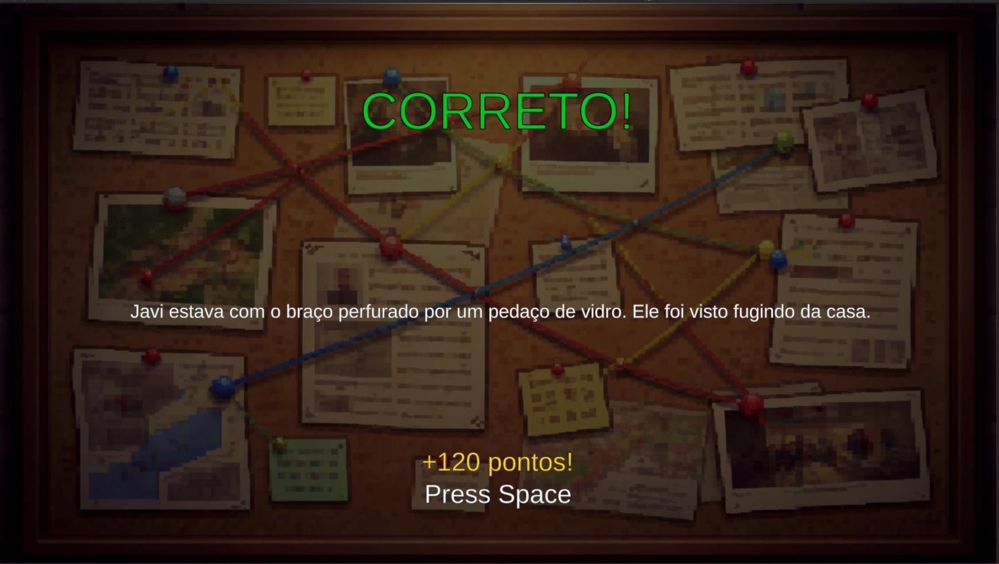
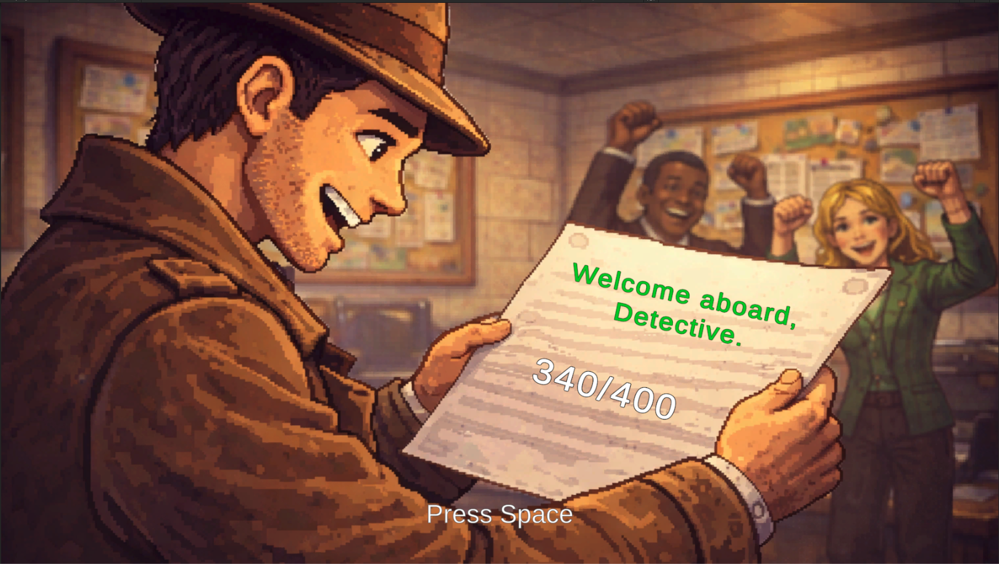

# 🕵️ Help the Detective

Um jogo investigativo desenvolvido para a [Tiny Game Jam (12/25)](https://itch.io/jam/tiny-game-jam-12-25).

## 📖 Sobre o Projeto

**Help the Detective** é um jogo de dedução onde você assume o papel de um detetive iniciante tentando entrar em uma área altamente restrita de investigação privada. Antes de ser aceito, você deve resolver uma série de casos antigos e não resolvidos, onde as evidências parecem apontar para uma verdade óbvia — mas estão erradas.

Este é um projeto especial criado em **parceria entre pai e filho**:
- **Eduardo dos Santos** - Desenvolvedor de software
- **Eduardo dos Santos Jr.** (11 anos) - Designer e artista

### 🎂 Uma Data Especial

O projeto foi submetido em **28 de dezembro**, data que coincide com o aniversário do Eduardo (pai), tornando este projeto ainda mais significativo. Poder criar algo lado a lado com meu filho e finalizar nesta data já é uma recompensa por si só.

---

## 🎮 Sobre o Jogo

### Mecânica Principal

Cada caso apresenta **dois suspeitos** e você deve descobrir qual deles está mentindo. O jogo testa sua capacidade de:

- 🔍 Olhar além das aparências
- 🧩 Entender o contexto
- ❓ Questionar conclusões fáceis

### Recursos do Jogo

- **3 casos investigativos** com histórias únicas
- **Sistema de dicas** (texto e imagem) com penalidade de pontos
- **Sistema de pontuação** baseado em acertos e dicas utilizadas
- **Dois idiomas**: Português (PT-BR) e Inglês (EN)
- **Finais diferentes** baseados na performance (70% de acerto para vitória)

### Screenshots

<p align="center">
  
  
  
  
</p>

<p align="center">
  
  
  
  
</p>

---

## 🎯 Tiny Game Jam (12/25)

Este jogo foi desenvolvido para a **[Tiny Game Jam (12/25)](https://itch.io/jam/tiny-game-jam-12-25)**, uma game jam focada em projetos pequenos e concisos.

### Timeline do Desenvolvimento

- **26/12/2025** - Início do projeto, brainstorming e conceitos visuais
- **27/12/2025** - Desenvolvimento da mecânica principal
- **28/12/2025** - Finalização e submissão

### Foco da Jam

O objetivo era manter o escopo **pequeno e focado**, enquanto experimentávamos com narrativa através de interpretação visual e contexto — adequado ao espírito de uma game jam curta.

---

## 🛠️ Tecnologias Utilizadas

### Engine e Ferramentas

- **Unity** - Game Engine
- **C#** - Linguagem de programação
- **TextMeshPro** - Sistema de texto
- **Input System** - Sistema de controle

### Assets e Recursos

- Alguns sprites e sons foram obtidos de **recursos livres de direitos autorais**
- Nem todas as imagens foram geradas por IA — **vários desenhos e ideias vieram diretamente do Eduardo Jr.**

### Ferramentas de IA

Utilizamos ferramentas de IA como **Gemini (Nano Banana)** e **ChatGPT**, principalmente para:

- Ajudar a traduzir a história e textos para inglês
- Auxiliar com conceitos e refinamento de imagens
- Melhorar clareza e consistência do conteúdo escrito

> **Importante:** A IA foi usada como **ferramenta de apoio**, não como substituta da criatividade. O projeto combina ideias humanas, aprendizado, experimentação e diversão.

---

## 🎨 Características Técnicas

### Sistema de Localização

- **Dois idiomas completos**: Português e Inglês
- **Troca de idioma em tempo real** sem necessidade de reiniciar
- **Textos traduzidos**: Interface, história, casos e soluções

### Sistema de Pontuação

```
Pontos Ganhos = Pontos Base - (Dicas Usadas × Penalidade por Dica)
```

- Caso 001: 100 pontos (penalidade: 20 por dica)
- Caso 002: 120 pontos (penalidade: 25 por dica)
- Caso 003: 150 pontos (penalidade: 30 por dica)

**Total máximo:** 370 pontos

### Recursos de Gameplay

- 🎲 **Casos embaralhados** - Ordem aleatória a cada partida
- 🔀 **Posições randomizadas** - Suspeitos aparecem em posições diferentes
- 💡 **Sistema de dicas** com penalidade
- 🏆 **Sistema de vitória/derrota** baseado em 70% de aproveitamento

---

## 🎓 Aprendizados

Este projeto foi uma oportunidade incrível de:

- **Pai e filho trabalhando juntos** em um projeto criativo
- Aprender sobre **desenvolvimento de jogos** na prática
- Experimentar com **narrativa e design de puzzles**
- Gerenciar **escopo e tempo** em uma game jam
- Usar **IA como ferramenta de apoio**, não como substituta

---

## 👨‍👦 Sobre os Criadores

**Eduardo dos Santos**
- Desenvolvedor de software em uma grande multinacional brasileira
- Não trabalha profissionalmente com jogos
- Este jogo existe por curiosidade, criatividade e o desejo de criar algo significativo com seu filho

**Eduardo dos Santos Jr. (11 anos)**
- Designer e artista do projeto
- Responsável por vários desenhos e ideias originais
- Primeira experiência em desenvolvimento de jogos

---

## 📝 Licença e Créditos

Este é um projeto educacional e experimental criado para a Tiny Game Jam.

**Créditos:**
- Desenvolvimento e Design: Eduardo dos Santos & Eduardo dos Santos Jr.
- Ferramentas de IA: Gemini (Nano Banana), ChatGPT
- Assets: Recursos livres de direitos autorais + arte original

---

## 🎮 Como Jogar

1. Leia a descrição do caso
2. Observe os dois suspeitos
3. Use dicas se necessário (mas perde pontos!)
4. Escolha quem você acha que é o culpado
5. Veja a explicação e descubra se acertou

**Controles:**
- Mouse/Touch para selecionar opções
- Espaço para fechar dicas e modais
- Interface intuitiva

---

## 🚀 Como Começar

### Pré-requisitos

- **Unity 2021.3 LTS** ou mais recente
- Conhecimento básico do Unity Editor (opcional)

### Como Testar o Projeto

1. **Clone o repositório**
   ```bash
   git clone https://github.com/Megamil-LTDA/help-the-detective.git
   cd help-the-detective
   ```

2. **Abra no Unity**
   - Abra o Unity Hub
   - Clique em "Add" → Selecione a pasta do projeto
   - Abra o projeto com Unity 2021.3 LTS ou mais recente

3. **Jogue**
   - No Unity, abra a cena `Assets/Scenes/Home.unity`
   - Pressione o botão Play ▶️
   - Divirta-se!

---

## 🎨 Crie Sua Própria Versão

O jogo foi projetado para ser facilmente customizável! Você pode criar seus próprios casos de detetive simplesmente editando arquivos JSON e adicionando imagens.

### Passo 1: Edite os Casos (JSON)

Os dados do jogo estão armazenados em dois arquivos:
- `Assets/Resources/Data-en.json` (versão em inglês)
- `Assets/Resources/Data-pt.json` (versão em português)

**Estrutura do JSON:**

```json
{
    "cases": [
        {
            "id": "case_001",
            "title": "Título do Seu Caso",
            "description": "Descrição do caso que aparece no início",
            "suspects": {
                "suspect_a": {
                    "id": "case_1_a",
                    "portrait": "case_1_a.png",
                    "name": "Nome do Suspeito"
                },
                "suspect_b": {
                    "id": "case_1_b",
                    "portrait": "case_1_b.png",
                    "name": "Nome do Suspeito"
                }
            },
            "clues": {
                "text_clue": {
                    "content": "Conteúdo da dica de texto"
                },
                "image_clue": {
                    "image": "clue_1.png",
                    "required_item": "magnifying_glass"
                }
            },
            "solution": {
                "culprit_id": "case_1_b",
                "innocent_id": "case_1_a",
                "explanation": "Explicação de por que este suspeito é culpado"
            },
            "score": {
                "points_on_correct": 130,
                "penalty_per_clue_used": 30
            }
        }
    ]
}
```

### Passo 2: Adicione Suas Imagens

Coloque suas imagens nas pastas corretas:

#### Retratos dos Suspeitos
- **Localização**: `Assets/Resources/Imagens/suspects/`
- **Formato**: PNG
- **Nomenclatura**: Deve corresponder ao campo `portrait` no JSON (ex: `case_1_a.png`)

#### Imagens das Dicas
- **Localização**: `Assets/Resources/Imagens/clues/`
- **Formato**: PNG
- **Nomenclatura**: Deve corresponder ao campo `image` no JSON (ex: `clue_1.png`)

### Passo 3: Teste Suas Alterações

1. Salve seus arquivos JSON
2. Adicione suas imagens nas pastas corretas
3. Abra o Unity e pressione Play ▶️
4. Seus novos casos devem aparecer no jogo!

### Dicas para Criar Casos

- ✅ Mantenha as descrições concisas e intrigantes
- ✅ Certifique-se de que as dicas visuais façam sentido com a história
- ✅ Balance a dificuldade - nem muito óbvio, nem impossível
- ✅ Teste ambas as versões de idioma se usar dois idiomas
- ✅ Ajuste pontos e penalidades para equilibrar o jogo

### Template de Exemplo

Confira `Assets/Resources/Data-Sample.json` para um template que você pode usar para criar novos casos!

---

## 🌟 Agradecimentos

Obrigado por jogar **Help the Detective**! Este projeto representa muito mais do que um jogo — representa tempo de qualidade, aprendizado e criatividade compartilhados entre pai e filho.

Se você gostou, considere deixar um feedback na [página da jam](https://itch.io/jam/tiny-game-jam-12-25)!

---

**Feito com ❤️ por Eduardo dos Santos e Eduardo dos Santos Jr.**

*Desenvolvido entre 26-28 de dezembro de 2025*
